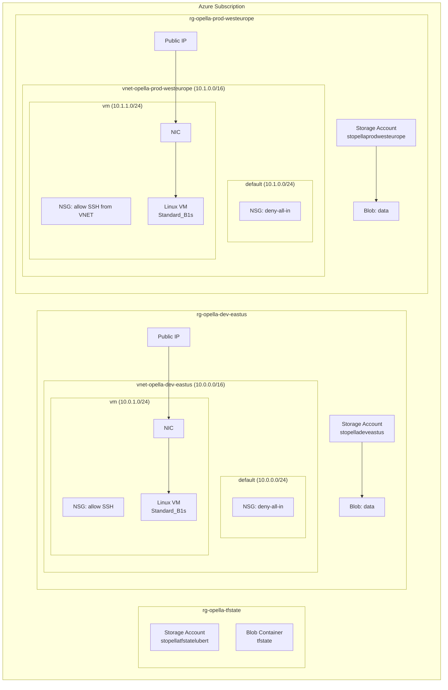
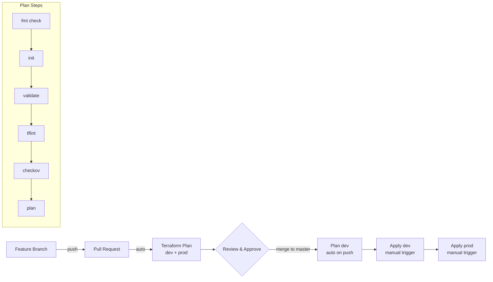
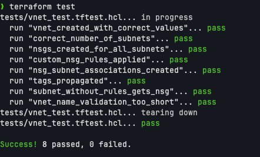
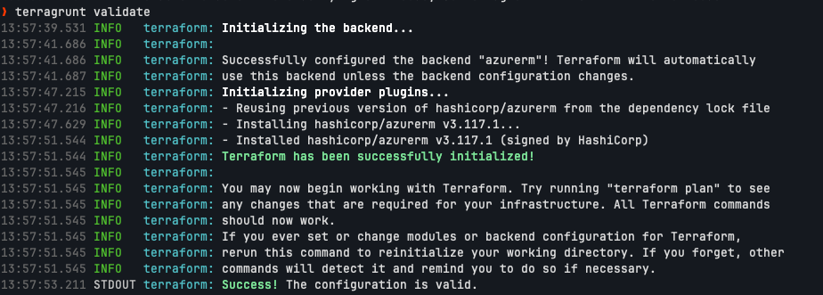

# Challenge Summary

## What Was Built

Azure infrastructure provisioned with Terraform, structured for multi-environment deployment with CI/CD automation.

## Reusable VNET Module (`modules/vnet/`)

Terraform module that provisions a Virtual Network with configurable subnets and Network Security Groups. Each subnet gets an NSG with a secure-by-default baseline (deny all inbound, allow all outbound) plus optional custom rules. Documentation is auto-generated via `terraform-docs`.

## Environments (`environments/dev/`, `environments/prod/`)

Two environments consuming the VNET module:

| | Dev | Prod |
|---|---|---|
| Region | eastus | westeurope |
| VNET CIDR | 10.0.0.0/16 | 10.1.0.0/16 |
| Storage replication | LRS | GRS |

Each environment provisions: Resource Group, VNET, Subnets, NSGs, Linux VM (Ubuntu 22.04, SSH-only auth), Public IP, Storage Account with blob container.

## Naming Convention & Tagging

All resources follow a consistent naming pattern computed via a shared `locals` block:

| Resource Type | Pattern | Example |
|---|---|---|
| Resource Group | `rg-{project}-{env}-{region}` | `rg-opella-dev-eastus` |
| Virtual Network | `vnet-{project}-{env}-{region}` | `vnet-opella-dev-eastus` |
| NSG | `nsg-{subnet_name}` | `nsg-vm` |
| Public IP | `pip-vm-{project}-{env}-{region}` | `pip-vm-opella-dev-eastus` |
| NIC | `nic-vm-{project}-{env}-{region}` | `nic-vm-opella-dev-eastus` |
| VM | `vm-{project}-{env}-{region}` | `vm-opella-dev-eastus` |
| Storage Account | `st{project}{env}{region}` | `stopelladeveastus` |

All resources are tagged with four mandatory tags: `environment`, `project`, `owner`, `managed_by`. Tags are passed to modules via a shared `tags` variable.

## Architecture Diagram



## CI/CD Flow



## Release Lifecycle

1. **Develop** — create a feature branch, make changes
2. **Pull Request** — plan runs automatically for both dev and prod, results posted as PR comments
3. **Review** — team reviews plan output and code changes
4. **Merge** — merge to `master`, dev plan runs automatically on push
5. **Deploy Dev** — manually trigger apply workflow, select `dev`
6. **Deploy Prod** — manually trigger apply workflow, select `prod`

## Remote State (`scripts/bootstrap-state.sh`)

Terraform state stored in Azure Blob Storage (`stopellatfstatelubert`) with per-environment state files. Bootstrap script provisions the storage account.

## CI/CD (`.github/workflows/`)

- **Terraform Plan** — runs automatically on push (dev) and PRs (dev + prod). Includes format check, validate, TFLint, Checkov, and plan.
- **Terraform Apply** — triggered manually via `workflow_dispatch` with environment selector.

See [GHubActions.md](GHubActions.md) for details and proof of execution.

## VNET Module Tests (`modules/vnet/tests/`)

Native Terraform tests (`terraform test`) with 8 test cases covering: VNET creation, subnet count, NSG creation, custom rules, NSG-subnet associations, tag propagation, secure-by-default baseline, and input validation.

Run locally with: `cd modules/vnet && terraform test`



## Code Quality

- **Pre-commit hooks**: `terraform fmt`, `terraform validate`, `terraform-docs`, `tflint`, `checkov`
- **TFLint**: Azure ruleset with naming convention and documentation rules
- **Checkov**: Static security scanning integrated in CI

Setup:
```bash
pip install pre-commit checkov
brew install terraform-docs tflint
pre-commit install
pre-commit run --all-files
```

## Terragrunt Compatibility

The codebase is structured so Terragrunt can be layered on without refactoring:

- **Modules are self-contained** — no cross-module dependencies via data sources
- **Environment configs use only variables** — no hardcoded values in `main.tf`
- **All backend config is parameterizable** — resource group, storage account, container, and key
- **Relative module paths** (`../../modules/vnet`) — compatible with both direct use and Terragrunt

Terragrunt would replace the `environments/` structure with a DRY hierarchy. Example:

```
terragrunt/
├── root.hcl                    # root config (backend, provider)
├── dev/
│   ├── env.hcl                 # environment-level vars
│   └── vnet/
│       └── terragrunt.hcl      # module invocation
└── prod/
    ├── env.hcl
    └── vnet/
        └── terragrunt.hcl
```

See [`terragrunt/`](../terragrunt/) for example configuration files.

Validated successfully — backend initialized, configuration valid:


