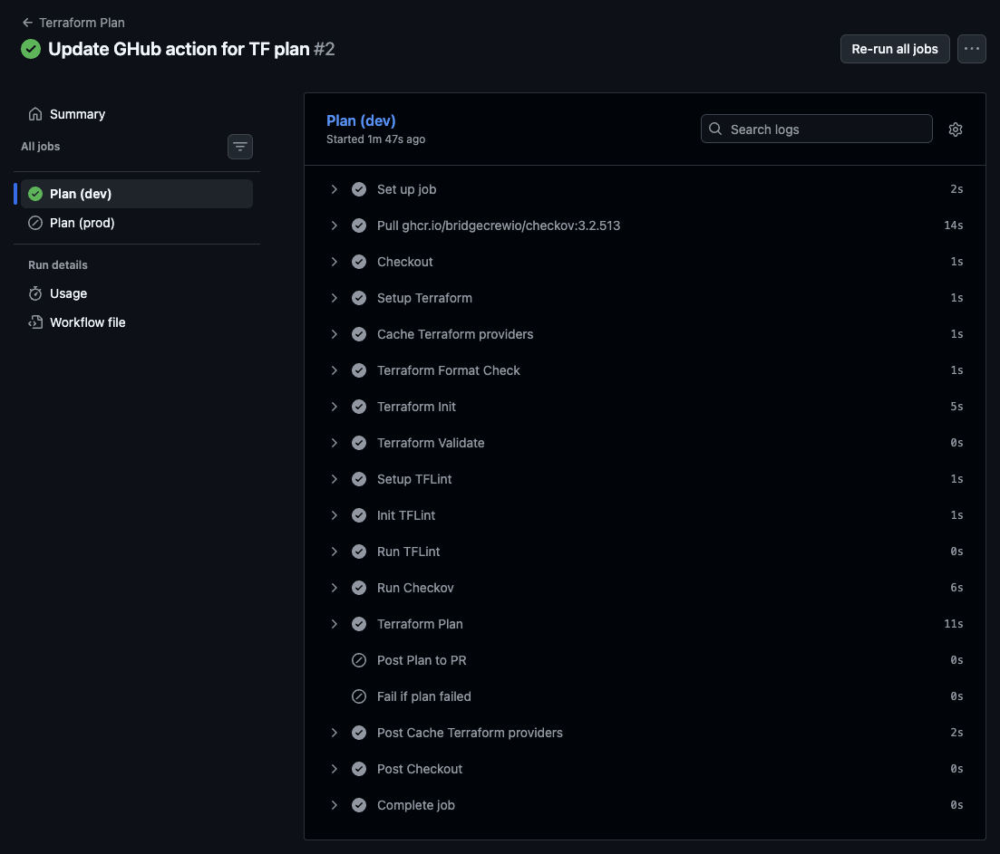

# CI/CD Pipeline — GitHub Actions

## Overview

This project uses GitHub Actions to automate Terraform workflows for the Azure infrastructure. Two workflows handle the plan and apply stages separately, following a GitLab-style pipeline approach.

### Terraform Plan (`.github/workflows/terraform-plan.yml`)

Runs automatically to validate and preview infrastructure changes:

- **Dev environment**: runs on every push to `master` and on pull requests
- **Prod environment**: runs only on pull requests

Each run executes the following steps:

1. **Terraform Format Check** — ensures consistent code formatting
2. **Terraform Init** — initializes providers (with caching for speed)
3. **Terraform Validate** — checks configuration syntax
4. **TFLint** — lints Terraform code with the Azure ruleset
5. **Checkov** — static security analysis (soft fail)
6. **Terraform Plan** — previews the changes to be applied
7. **Post Plan to PR** — comments the plan output on the pull request

### Terraform Apply (`.github/workflows/terraform-apply.yml`)

Triggered manually via `workflow_dispatch` from the Actions tab. Allows selecting `dev` or `prod` from a dropdown. Runs a plan first, then applies.

## Proof of Successful Execution

The plan workflow ran successfully for the dev environment, completing all steps including format check, init, validate, TFLint, Checkov, and plan.

**Plan result**: 15 resources to add, 0 to change, 0 to destroy.

Full logs are available in [`assets/logs_62583902635.zip`](assets/logs_62583902635.zip).

### Resources planned for dev

| Resource | Name |
|---|---|
| Resource Group | `rg-opella-dev-eastus` |
| Virtual Network | `vnet-opella-dev-eastus` |
| Subnets (x2) | `default`, `vm` |
| NSGs (x2) | One per subnet with deny-all-inbound baseline |
| NSG Rules | Custom rules per subnet |
| NSG-Subnet Associations (x2) | Binds NSGs to subnets |
| Public IP | `pip-vm-opella-dev-eastus` |
| Network Interface | `nic-vm-opella-dev-eastus` |
| Linux VM | `vm-opella-dev-eastus` (Ubuntu 22.04, Standard_B1s) |
| Storage Account | `stopelladeveastus` |
| Storage Container | `data` |
